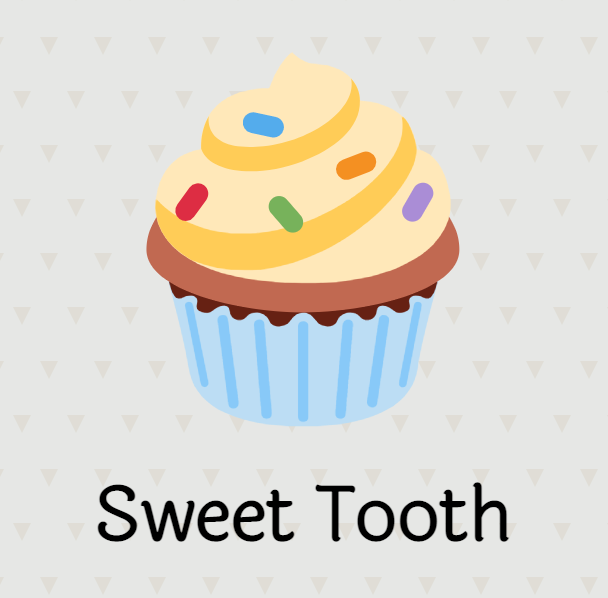

# Sweet Tooth

## ☟ LINK BELOW ☟
## 🧁 [SWEET TOOTH](...) 🧁

## Background & Description
Welcome to **SWEET TOOTH**!  
Do you have a sweet tooth? If yes, we're here to help you keep track of all your favorite desserts and recipes you may find online. You can also create a list of locations - or 'sweet spots' - where you can find your listed dessert. Feel free to include all kinds of desserts, ranging from baked goods to frozen treats. Enjoy! 🍦

Sweet Tooth was built as my final project at General Assembly. The full-stack reference application was required to be built using Django, PostgreSQL, Python and functionally perform CRUD operations.

As a lover of desserts, with an interest in baking, I chose to build this application for those of similar interests who may want to keep track of their favorite dessert places and recipes.

## Screenshots of the App 📸

<!--  

 -->

## Technology Used
  - CSS
  - Django
  - Docker
  - Git/GitHub
  - HTML
  - PostgreSQL
  - Python

## Credits
- [Google Fonts](https://fonts.google.com/)
- [Hero Patterns](https://heropatterns.com/)
- [SVG Repo](https://www.svgrepo.com/)

## Icebox Items 🧊
  - [x] Provide the option to remove a 'sweet spot' from a dessert details page
  - [ ] Create a community among users who may want to view others' favorite desserts/recipes/locations
  - [ ] Allow users to comment and give feedback on 'sweet spot' locations
  - [ ] Provide the option for users to upload their own images when a dessert is added